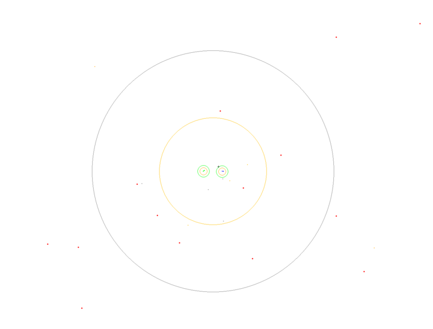

# Testbed4HAT

## Description
This is the repository for the Testbed4HAT project simulation environment. The environment is a notional 
simulation of a ship defense game in which stationary 
ships/boats in open water are under attack from anti-ship missiles (cruise missiles). The ships are equipped with weapons 
(interceptors) 
to defend themselves (and each other) against incoming threats. The physics for the threats and the weapons are very 
simplified, and the effectiveness of both threats and weapons are determined with very simple probability profiles. 
Threats do not come 
from any particular entity, rather they are spawned by the environment according to the environment configuration.

The simulation is meant to be used to test both humans and AI algorithms, especially humans using AI decision aids to 
collaboratively solve a weapons planning game. As such, it is designed to provide simple and human-readable 
information. This information is then be adapted for use with automated algorithms. 

The environment may be rendered using [PyGame](https://www.pygame.org/news), as shown here:



Ships are represented by rounded rectangles randomly placed around the center of the environment (shown as a crosshair),
have location and orientation, but no velocity (i.e. they do not move). 

Threats are shown as 2D "balls" on the screen, moving towards the ships from some location towards the exterior of
the environment. In this case, there are two threats, shown as red and orange balls. The different types of threats 
have slightly different characteristics. An orange ring around the ship/boat shows the effective range of a threat's
kill on detonation. 

Weapons are also shown as 2D "balls" on the screen, but are smaller, have different colors than threats, and originate
at a ship, moving in a direction to intercept a threat. There are also two, in this case. The different weapons have 
different characteristics as well, e.g. effectiveness at different ranges. In this case the rings help show the 
effective ranges of the weapons. The green rings close to the ships show an average minimum effective distance of both
weapons, while the other two right show an average maximum effective distance of each weapon, corresponding to each
weapon's color. 

## Installation
This code is set up as a Python module for easy installation with `pip`. To install, navigate to the top level directory
and use the following command in the terminal:

```bash
pip install -e .
```

We recommend first creating a virtual environment such as with `venv` or `conda`. 

The installation will require python open source packages, including:
```
pygame
json
unittest
gymnasium
numpy
```

## Usage
Basic usage is relatively straightforward. One may run the simulation with the following code:

```python
from testbed4hat.hat_env import HatEnvConfig, HatEnv

config = HatEnvConfig()
env = HatEnv(config)
terminated = False
truncated = False
obs, info = env.reset()
while not (terminated or truncated):
    action = []
    obs, reward, terminated, truncated, info = env.step(action)
```

This launches the simulation using default parameters in the `HatEnvConfig` object, and specifies that no actions be 
taken at each step. More interesting behavior can be generated by updating the parameters in the `HatEnvConfig`, and by
passing actions to the environment to take at some step. To examine the possible configurations, see the 
definition of the config object in [hat_env.py](testbed4hat/hat_env.py). 

The `HatEnvConfig` object can be updated by passing it a Python dictionary or a path to a JSON file with the appropriate
key, value pairs. 

# HatEnvConfig: Configuring the environment

The environment configuration is completely determined via the `HatEnvConfig` object. There are various ways to 
reference how to use this object for environment configuration. The first, and most obvious, is to examine the source 
code in [hat_env_config.py](testbed4hat/hat_env_config.py). Additionally one may create a `HatEnvConfig` object with no
inputs, leaving all values as defaults, and call the `description` method to print parameter information to the console,
like so:

```python
from testbed4hat.hat_env_config import HatEnvConfig
cfg = HatEnvConfig()
cfg.description()
```

This prints information about all parameters in settable in the config. 

To set values of the config, one can either specify a Python dictionary, a string denoting a path to a JSON file, or
one may initialize the object first, and then directly set the object parameters via the `set_parameter` method (safer),
or directly (may not set a valid parameter). 

```python
from testbed4hat.hat_env_config import HatEnvConfig
from testbed4hat.hat_env import HatEnv

# Specify some parameter values using a dictionary
cfg = HatEnvConfig({"zoom": 1.1, "seed": 42})
env1 = HatEnv(cfg)

# Specify some parameter values using a JSON file 
cfg = HatEnvConfig("path/to/my_config.json")
env2 = HatEnv(cfg)

# Specify parameters directly after initialization -- Safe (checks that the parameter is valid in the config)
cfg.seed = 42
cfg.set_parameter("num_ship_0_weapon_0", 25)
cfg.set_parameter("num_ship_1_weapon_0", 22)
# cfg.set_parameter("non_existent_parameter", 1000)  # Raises exception because the parameter is not part of the config!

# If we want to be careful, we can validate our updated parameters before passing the config to the environment (this is
#   done automatically in the previous two cases). 
cfg.validate()

env3 = HatEnv(cfg)

# Specify parameters directly after initialization -- Dangerous (can set an invalid parameter and have no warning)
cfg = HatEnvConfig()
cfg.seed = 42
cfg.num_ship_0_weapon_0 = 25
cfg.num_ship_1_weapon_0 = 22
cfg.non_existent_parameter = 22  # Will NOT affect the simulation and will NOT raise any errors or warnings!

cfg.validate()  # Also will not catch the above error

env4 = HatEnv(cfg)
```


# Actions


The only actions currently available are instructions to launch a weapon at a given threat. This takes the form of a
tuple: 

                                    (ship_id: int, weapon_id: int, threat_id: str)

Ship IDs are 1 and 2, weapon IDs are 0 and 1, and threat IDs are strings that can be obtained from the observations. 

Multiple instructions for launches can be passed to the `step` function at a time. A step consists of some amount of
time, over which, the simulation will attempt to execute the provided actions in the order they were given. Only so
many actions can be taken during a step due to limited time per step and weapon reload times. Additionally, there is a
limited inventory of weapons per ship, so if weapon inventory is exhausted for a ship, that weapon may no longer be 
fired from that ship.

## Observations


Observations from this environment consist of dictionaries of the form:

```
{"ship_0": dict, "ship_1": dict, "launched": list, "failed": list, "messages": list}
```

Ship observations are also dictionaries containing information about each ship, its current weapon inventory, and 
detected threats.

The information in the "launched" value is a set of messages specific to weapon information. When actions are passed
to the environment providing weapon launch instructions, successful launches are reported here. Alternatively, when
launches fail, that information is reported in the "failed" list, providing information about which launch failed and
why.

Lastly, the "messages" list provides useful information about events occurring within a given step, such as invalid 
actions, wasted munitions, and what ship was destroyed (if one is destroyed). 

## Probabilities of successful interception versus range, threat, and interceptor type

The following graph shows how the probability of a successful interception varies with range, threat type, and interceptor type. Note that the range refers to the range at which the inteceptor reaches the threat, which can be calculated based on the threat speed and interceptor speed (but also is provided by the simulation status updates).


Threat 1 has a velocity of 7.5 km/min and threat 2 has a velocity of 9 km/min. 

## License

Copyright (c) 2024, The Johns Hopkins University Applied Physics Laboratory LLC
All rights reserved.

This project is licenced under a BSD 3-Clause License.

Licensed under the 3-Clause BSD License (the "License");
you may not use this file except in compliance with the License.
You may obtain a copy of the License at
https://opensource.org/licenses/BSD-3-Clause

Unless required by applicable law or agreed to in writing, software
distributed under the License is distributed on an "AS IS" BASIS,
WITHOUT WARRANTIES OR CONDITIONS OF ANY KIND, either express or implied.
See the License for the specific language governing permissions and
limitations under the License.
